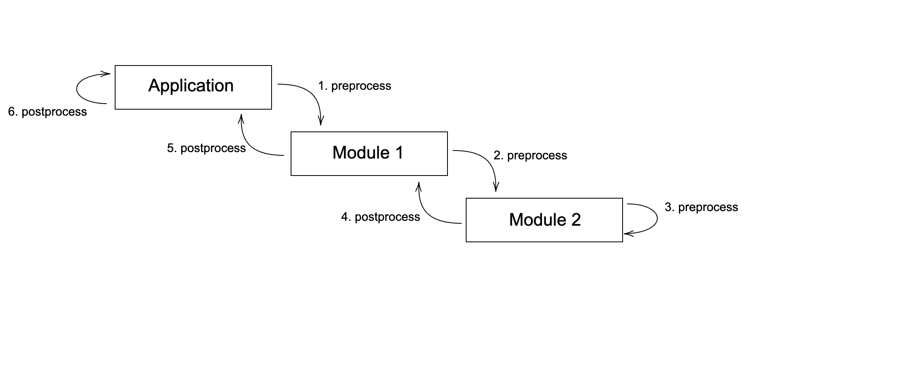

Developer
==========

The QUARK project welcomes and encourages participation by everyone. This framework is designed to be as modular as possible
to allow developers to easily add new components which are crucial for the continuous development of this framework as
the quantum computing field matures.

Extending the Framework
-----------------------

In this section, we will briefly talk about how one can add a new module type to the existing ones.
While with the original release of QUARK one was limited to the modules application, mapping, solver, or device, with
the release of QUARK one can add arbitrary modules.

A good starting point is to look at the already existing components.

Adding a New Module Type
~~~~~~~~~~~~~~~~~~~~~~~~

If the already existing module types (see "modules" directory) do not fit your needs, you can create new abstract module definitions, where you can specify your requirements.

The only prerequisite is that they must fulfill the `Core` module requirements since every module needs to inherit from this abstract class.

The essential functions of the `Core` module, which can be used by every module/subclass to execute its logic (see figure), are the `preprocess` and the `postprocess` methods.
The `preprocess` method executes before the input data is passed on the sub-module, while the `postprocess` method runs before the data is passed to the parent module.
If no sub-module/parent module exists, these functions will still be executed.

For a concrete application, the `preprocess` step could include generating the problem instance for an optimization problem, while the `postprocess` would include the validation and evaluation of the solution for a given problem.

You can also implement a new module type that inherits from another abstract module. So, for example, assume an `Optimization` class that specifies the requirements for an optimization application. This `Optimization` class inherits the requirements from the more general `Application` class.

Every class also needs to implement the `get_requirements` method, where one specifies which imports are used by this class and which version. This is required to inform the user about which packages need to be installed.

Adding a New Class for an Existing Module Type
~~~~~~~~~~~~~~~~~~~~~~~~~~~~~~~~~~~~~~~~~~~~~~
This section discusses how to add a new class to an existing module type.

For every component, there is an abstract class that a new class inherits from. These abstract classes provide the required functions which are needed for the benchmarking process. So, for example, if you want to implement a new application, it must inherit from the abstract `Application` class.

Adding a New Application
^^^^^^^^^^^^^^^^^^^^^^^^

Alongside adding a new application, you should always add at least one submodule to make the application available for
another module (for example, a solver). Also, the new application has to be added to the :code:`get_default_app_modules` function in the :code:`main` function.

Every application has functions that are required to be implemented:

    - :code:`get_parameter_options(self)`: Method to return the parameters needed to create a problem instance of an application as a dictionary.
    - :code:`save(self, path)`: Method to store the application instance as a file. Needed for making experiments reproducible.
    - :code:`get_requirements()`: Method to return which packages are used by this application.
    - :code:`get_default_submodule(self, option)`: Method to return an instance of a submodule class based on :code:`option` string.
    - :code:`preprocess(self, input_data: any, config: dict, **kwargs)`: Method which is always called. It is used to pass certain information (:code:`input_data`) to the next sub-module.
    - :code:`postprocess(self, input_data: any, config: dict, **kwargs)`: Method which is always called. It is used to pass certain information (:code:`input_data`) to the next parent module.

Also, you need to specify the available mapping options :code:`submodule_options` in the constructor of the application class.
With specifying the solvers in :code:`get_default_submodule(self, option)` and :code:`submodule_options` you decide which mapping is
available for that application.
In :code:`get_parameter_options(self)`, you can specify which parameters the user can choose from for this module.

In addition, there are some special flags you can set for each parameter:

    - :code:`allow_ranges`: Enabling this feature for your parameter will give the user the option to enter a range for this value. Keep in mind that there is no validation of this user input!
    - :code:`custom_input`: Enabling this feature for your parameter will give the user the option to enter a custom input (text or numbers) for this value. Keep in mind that there is no validation of this user input!
    - :code:`postproc`: Specifies a function that can be called and applied to the parameters, which must be callable.

Application Score
"""""""""""""""""

For applications, there is the option to provide a set of fields representing the application score, which defines the
overall quality of the benchmark run in the view of the application.
If these three fields are present in the :code:`Metrics` object of the application, the :code:`Plotter` class will generate some plots visualizing the application score:

    - "application_score_value": Value of the application score. None if there is no valid application score for this run.
    - "application_score_unit": Unit of the application will be used for the y-axis of the application score plot.
    - "application_score_type": The type of the application score needs to be a string. For example :code:`str(float)`.

Example for an application, which should reside under ``src/modules/applications/myApplication/``:

.. code-block:: python

        from modules.applications.Application import *
        from utils import start_time_measurement, end_time_measurement

        class MyApplication(Application):

            def __init__(self):
                super().__init__("MyApplication")
                self.submodule_options = ["submodule1"]

            @staticmethod
            def get_requirements() -> list:
                return [
                    {
                        "name": "networkx",
                        "version": "3.2.1"
                    },
                    {
                        "name": "numpy",
                        "version": "1.26.4"
                    }
                ]

            def get_default_submodule(self, option: str) -> Core:

                if option == "submodule1":
                    return Submodule1()

                else:
                    raise NotImplementedError(f"Submodule Option {option} not implemented")

            def get_parameter_options(self):

                return {
                    "size": {
                        "values": [3, 4, 6, 8, 10, 14, 16],
                        "description": "What size should your problem be?"
                        "allow_ranges: True,
                        "postproc": int
                    },
                    "factor": {
                        "values": [0.75, 1.0, 1.25],
                        "description": "By which factor would you like to multiply your problem?",
                        "custom_input": True,
                        "postproc": float # Since we allow custom input here we need to parse it to float (input is str)
                    }
                }

            class Config(TypedDict):
                size: int
                factor: float

            def preprocess(self, input_data: any, config: dict, **kwargs) -> (any, float):

                # Generate data that gets passed to the next submodule
                start = start_time_measurement()
                output = self.generate_problem(config)
                return output, end_time_measurement(start)

            def postprocess(self, input_data: any, config: dict, **kwargs) -> (any, float):

                # Process data passed to this module from the submodule
                solution_validity, time_to_validation = self.validate(
                    input_data)
                if solution_validity and processed_solution:
                   solution_quality, time_to_evaluation = self.evaluate(processed_solution)
                else:
                   solution_quality = None

                self.metrics.add_metric_batch({"solution_validity": solution_validity,
                          "application_score_value": solution_quality, "application_score_unit": "score",
                          "application_score_type": str(float), "solution": input_data})

                return solution_validity, sum(time_to_validation, time_to_evaluation))

            def generate_problem(self, config: Config, iter_count: int):

                size = config['size']

                self.application = create_problem(size)
                return self.application

            def validate(self, solution):
                start = start_time_measurement()

                # Check if solution is valid
                if solution is None:
                  logging.error(f"Solution not valid")
                    return False, end_time_measurement(start)
                else:
                    logging.info(f"Solution valid")
                    return True, end_time_measurement(start)

            def evaluate(self, solution):
                start = start_time_measurement()

                evaluation_metric = calculate_metric(solution)

                return evaluation_metric, end_time_measurement(start)

            def save(self, path, iter_count):
                save_your_application(self.application, f"{path}/application.txt")

Writing an asynchronous Module
^^^^^^^^^^^^^^^^^^^^^^^^^^^^^^
A typical example for an asynchronous module is a solver which submits its job into
the queue of some server and retrieves the result some times later. In QUARK this is
supported via the interrupt/resume mechanism.

QUARK modules may return instructions to the BenchmarkManager as first entry in the return value of
pre and post-process. Currently the following instructions are supported:
    - PROCEED
    - INTERRUPT

PROCEED: If the BenchmarkManager gets the instruction "PROCEED" (or no instruction at all) it continues with the regular QUARK workflow.
If the current job can be finished without getting an "INTERRUPT" instruction or an exception,
the BenchmarkManager adds "quark_job_status"=FINISHED to the metrics.

INTERRUPT: If the BenchmarkManager gets the instruction "INTERRUPT" it stops the current QUARK workflow,
adds "quark_job_status"=INTERRUPTED to the metrics, saves all the metrics written so far to the BenchmarkRecord
and continues with the configuration/repetition loop.

QUARK Resume Mode:

After running QUARK in its regular mode QUARK can be run again on the same results directory in resume mode by
specifying the existing results directory with the --resume-dir option. This can be done repeatedly for the same
results directory.

If QUARK is called in resume mode the module which has returned an INTERRUPT previously will be called again
with the same input supplemented by the key word argument "previous_job_info" which contains all the information
the moduls has written to the metrics on the previous run.

Updating the Module Database
^^^^^^^^^^^^^^^^^^^^^^^^^^^^

After adding a new module or making a module available for another module, you need to update the module database stored
under `.settings/module_db.json`. You might also need to update your current QUARK module environment so that your new
modules can be used. You can update this database automatically via `python src/main.py env --createmoduledb`.

**Note:** For `python src/main.py env --createmoduledb` to work you need to have all packages from all modules installed!

Review Process
~~~~~~~~~~~~~~~

Every pull request (PR) is reviewed to help you improve its implementation, documentation, and style.
As soon as the PR is approved by the minimum number of required reviewers, the PR will be merged to the main branch.
