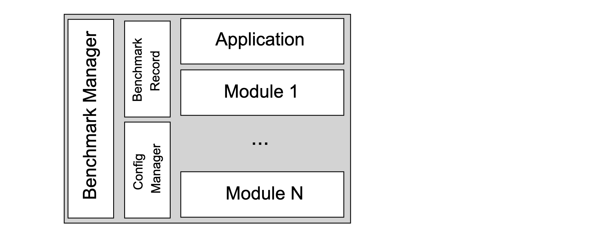

.. QUARK documentation main file, created by
   sphinx-quickstart on Fri Feb  4 11:04:21 2022.
   You can adapt this file completely to your liking, but it should at least
   contain the root `toctree` directive.

Welcome to QUARK's Documentation!
=================================

**QUantum computing Application benchmaRK** (QUARK) is a framework for designing, implementing, executing, and analyzing
benchmarks. The QUARK framework aims to facilitate the development of application-level benchmarks. The framework simplifies
the end-to-end process of designing, implementing, conducting, and communicating application benchmarks.

**Note:** This documentation is currently being built and is not complete!

The following figure depicts the main components of the framework. The framework
follows the separation of concerns design principle encapsulating application- and problem-specific aspects, mappings
to mathematical formulations, solvers, hardware or other custom module definitions.

Publications
============

Details about the motivations for the original framework can be found in the [accompanying QUARK paper from Finžgar et al](https://arxiv.org/abs/2202.03028). The data used for the paper can be found in ``results/results.csv``. Even though the architecture changes significantly from QUARK 1.0 to the current version, the guiding principles still remain. The most recent publication from [Kiwit et al.](https://arxiv.org/abs/2308.04082) provides an updated overview of the functionalities and quantum machine learning features of QUARK.

.. toctree::
   :maxdepth: 2
   :caption: Contents:

   tutorial
   developer
   analysis
   reference

License
========

QUARK is licensed under the Apache License, Version 2.0.

Indices and Tables
==================

* :ref:`genindex`
* :ref:`modindex`
* :ref:`search`
