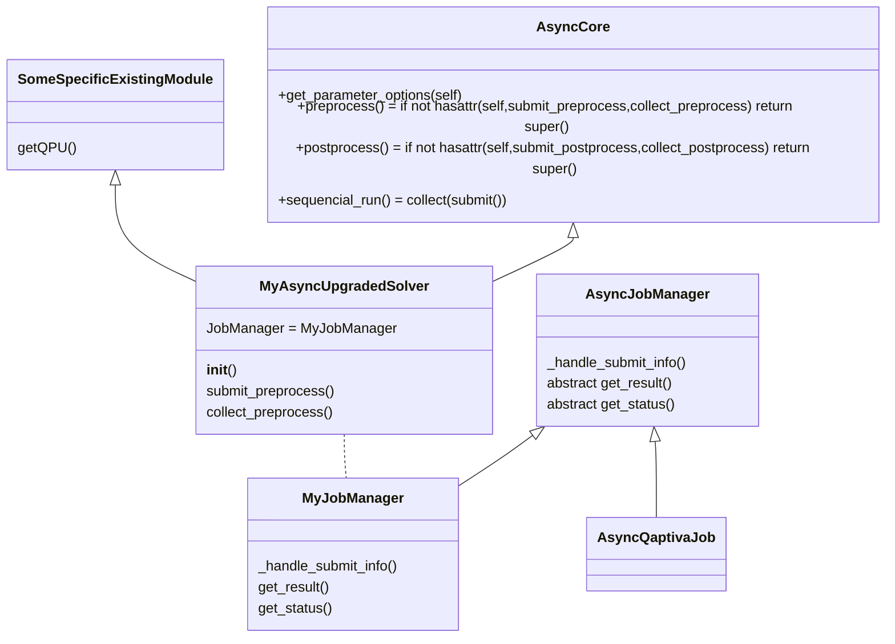
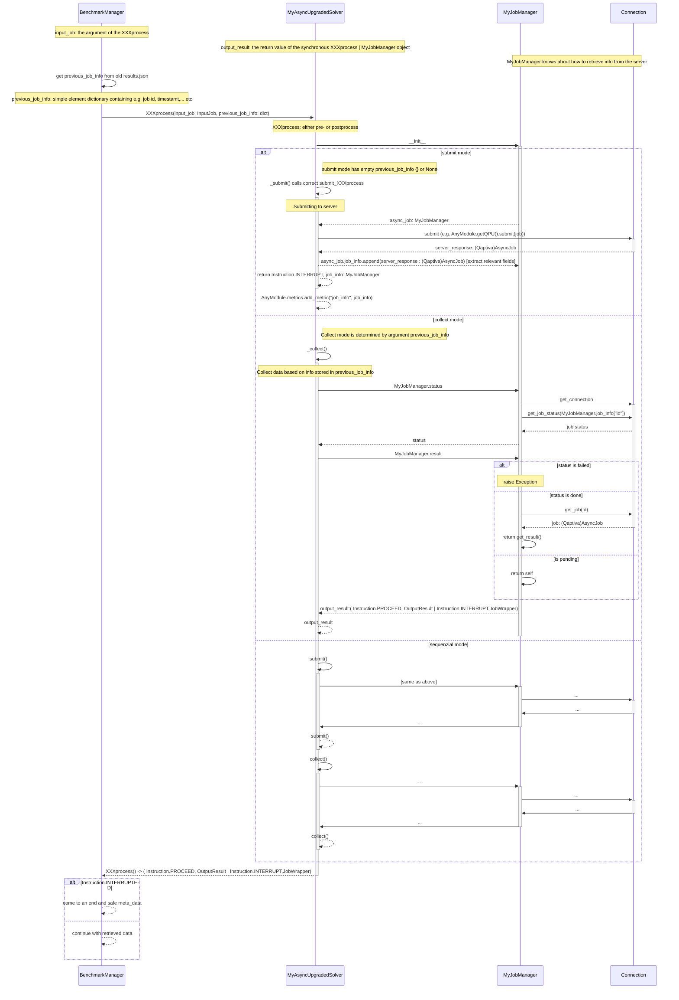
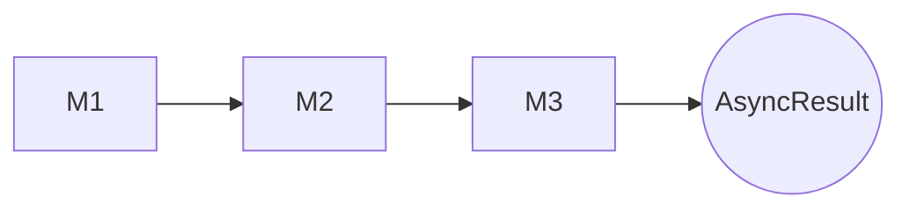
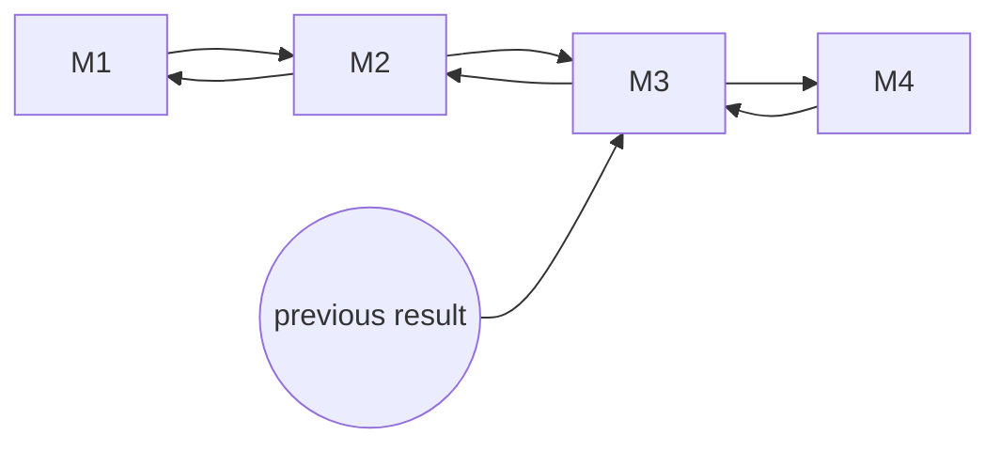

# Async mode

For the Async mode two important classes are introduced:

- The __AsyncCore__, inheriting from Core, from which a QUARK2 module should inherit from to enable the async functionality
- The __AsyncJobManager__, which is a an abstract base class from which specific AsyncJobManager need to inherit from. The derived classes encode the site-specific logics


## The AsyncCore module

Instead of inheriting from Core the user needs to inherit from AsyncCore and call the super-constructor with the argument interruptable="PRE", "POST" or even "PREPOST" depending on which part of the module should potentially run asynchronous. Unlike a normal module, the user now needs to implement the methods submit_XXXprocess and collect_XXXprocess.
The submit_X is required, whereas if the collect_X is not implemented, the default implementation just passes the server result.
Note that no 
To facilitate the conversion of a conventional QUARK module such as a solver, it is also possible to inherit from AsyncCore and Solver or an already implemented class.
Within the class definition, the JobManager variable must be set to the desired AsyncJobManager class. 

```python

import MyJobManager
class MyAsyncUpgradedSolver(AsyncCore, SomeSpecificExistingModule):
    
    JobManager = MyJobManager
    
    def __init__(self, name: str = None):
        AsyncCore.__init__(self, interruptable="POST", name=name)
        SomeSpecificExistingModule.__init__(self)
    
    def submit_postprocess(self, input_data, config, **kwargs):
        ...        
        return stack.submit(job) # return the return value of the submision 
    
    def collect_postprocess(self, server_result):
        result = do_something_with_the_resultserver_result
        final_energy = result.value
        return final_energy, result
```
## The AsyncJobManager 

Within the AsyncJobManager the complete logic regarding the communication with a specific asynchronous process (e.g. QLMaaS, Qiskit-IBMQ) is handled. The QaptivaAsyncJobManager is already provided. 

```python
class MyJobManager(AsyncJobManager):
    def get_result(self) -> AsyncResult:
        """returns the object, that is returned by the Service (e.g. Qaptiva)"""
        return result
    
    def get_status(self) -> AsyncStatus:
        # returning  AsyncStatus.FAILED, AsyncStatus.DONE or AsyncStatus.SUBMITTED
        ...

    
    def _handle_submit_info(self, value: AsyncResult):
        # the input "value" is the object that is returned as response, when using the 
        # function that submits something to the server, e.g:
        # set all information that are crucial for identification of the job afterwards
        self.set_info(id=value.job_id)
        self.set_info(host=value.connection.hostname)
        self._job_info["server_response"] = value
```

## Class structure



## Behind the scenes

The following is not absolutely necessary for the end user to know, but is intended to show how QUARK deals with asynchronous jobs.

### Instructions

Instruction is an enum and each XXXprocess return value prefixed with such an instruction so that the BenchmarkManager recognizes whether a continuation of the benchmark run is desired or whether simply the job-meta data should be saved in the results.json.

### Sequence Diagram





# Basic Idea
The QUARK module M3 in the following graph supports asynchronous execution.
QUARK supplies a data type AsyncResult.
If the benchmark manager receives an AsyncResult from one of the modules it stops the execution of the current module 
stack and stores the result data written by the modules so far.
M3 writes all data needed to continue its task later.


continue-mode

The benchmark manager adds the

