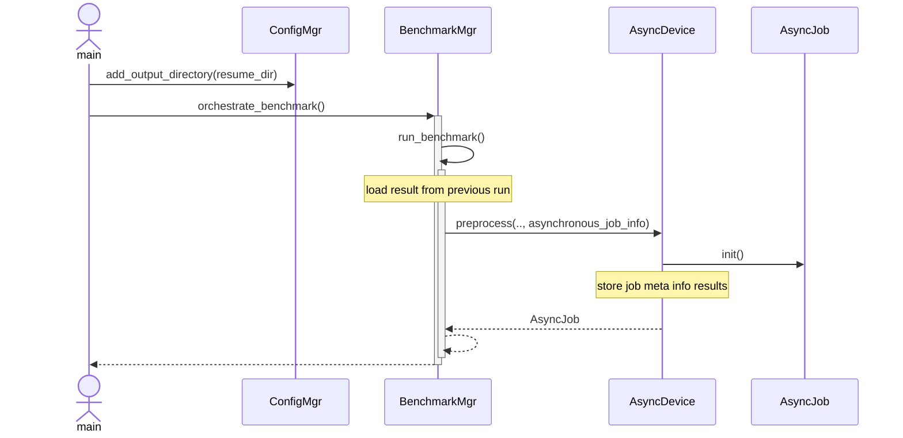
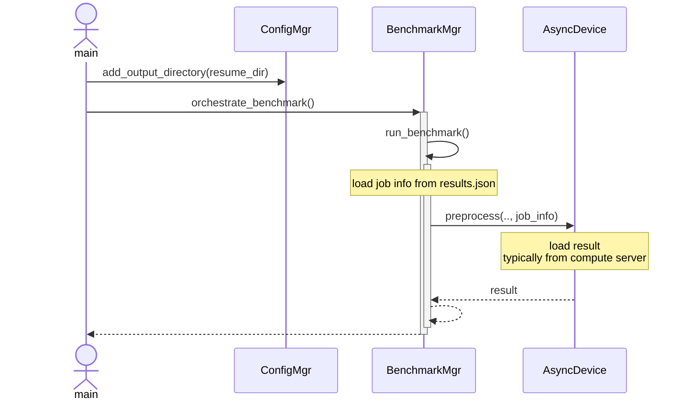

submit mode

```mermaid
sequenceDiagram
    actor main
    participant CM as ConfigMgr
    participant BM as BenchmarkMgr
    participant AD as AsyncDevice
    participant AJob as AsyncJob
    main ->> CM: add_output_directory(resume_dir)
    main ->> +BM: orchestrate_benchmark()
    BM ->> +BM: run_benchmark()
    Note over BM: load result from previous run
    BM ->> AD: preprocess(.., asynchronous_job_info)
    AD ->> AJob: init()
    Note over AD: store job meta info results
    AD -->> BM: AsyncJob
    BM -->> -BM: 
    BM -->> -main: 
    
    
```
resume mode

```mermaid
sequenceDiagram
    
    actor main
    participant CM as ConfigMgr
    participant BM as BenchmarkMgr
    participant AD as AsyncDevice
    main ->> CM: add_output_directory(resume_dir)
    main ->> +BM: orchestrate_benchmark()
    BM ->> +BM: run_benchmark()
    Note over BM: load job info from results.json
    BM ->> AD: preprocess(.., job_info)
    Note over AD: load result <br> typically from compute server
    AD -->> BM: result
    BM -->> -BM: 
    BM -->> -main: 

```