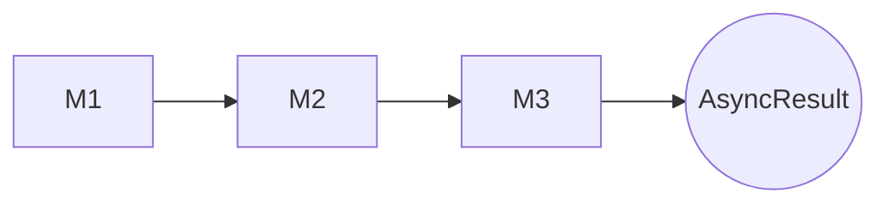
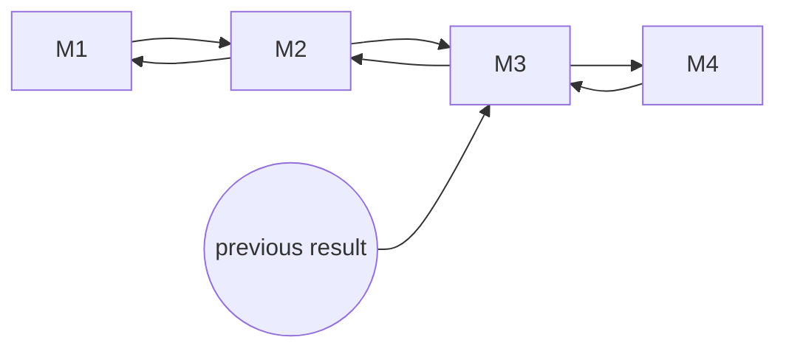
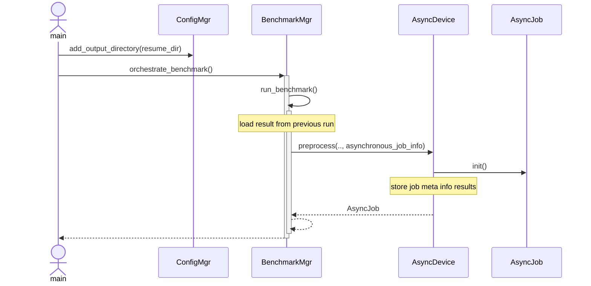
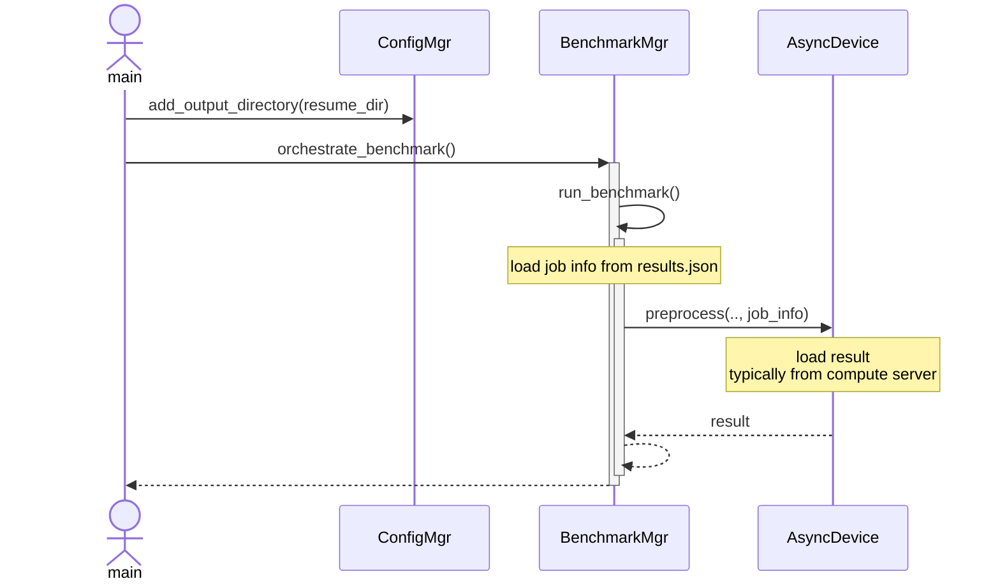

# Async mode
# Basic Idea
The QUARK module M3 in the following graph supports asynchronous execution.
QUARK supplies a data type AsyncResult.
If the benchmark manager receives an AsyncResult from one of the modules it stops the execution of the current module 
stack and stores the result data written by the modules so far.
M3 writes all data needed to continue its task later.

continue-mode

The benchmark manager adds the

# Details
submit mode

resume mode
