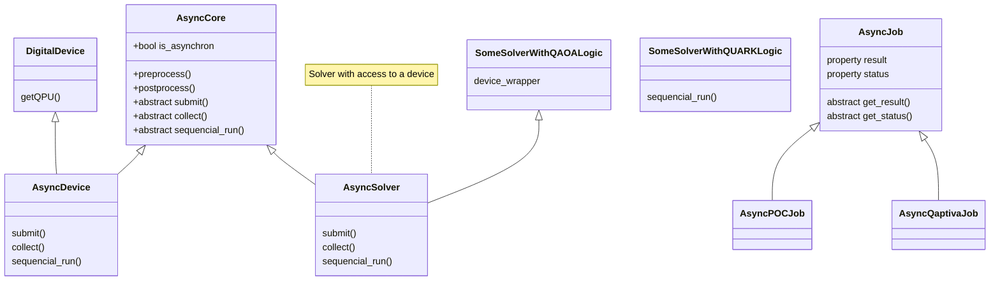
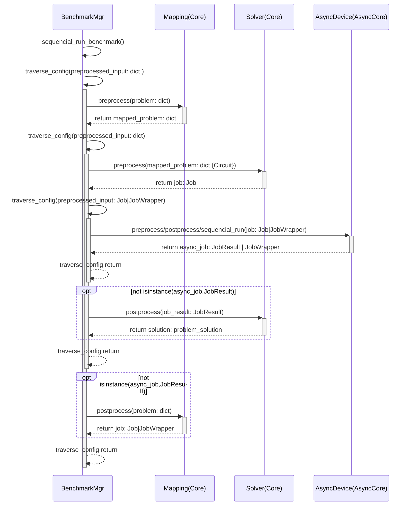
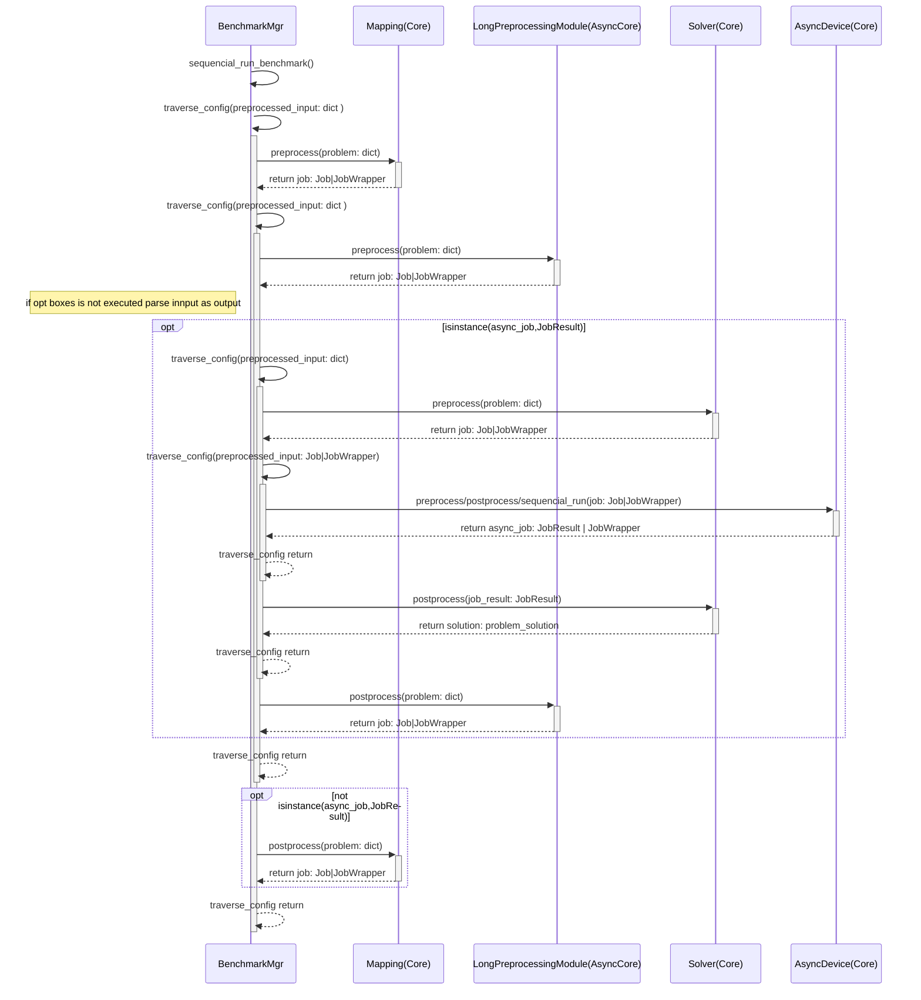
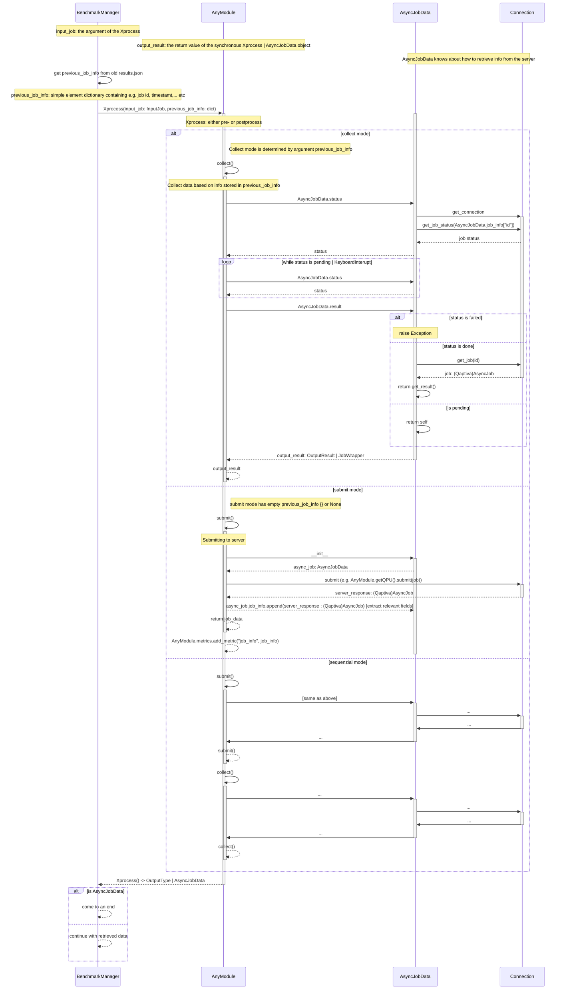

# Class diagram

# Sequence diagramgs

## Sequence: Async in leaf or postprocess

## Sequence: Async happens in preprocess

# Messi all-modules-are-Async diagram 

It is also possible with the current state of the BenchmarkManager to have several/all modules Async.

TODO: draw diagram

# Any pre- or postprocessing module has the common form:

