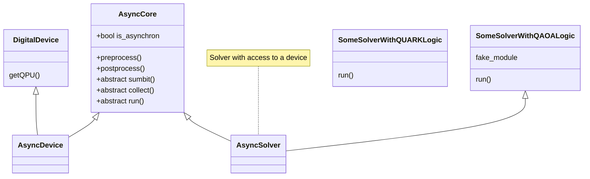
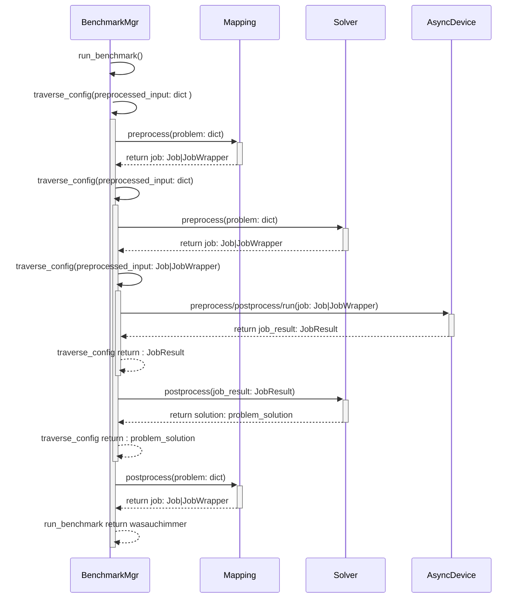
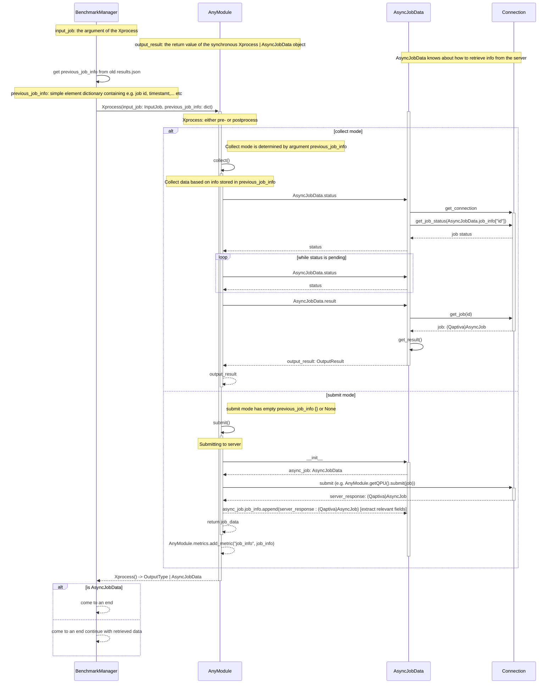

## Class diagram

```mermaid
classDiagram


DigitalDevice <|-- AsyncDevice
AsyncCore <|-- AsyncDevice
AsyncCore <|-- AsyncSolver
SomeSolverWithQAOALogic <|-- AsyncSolver


note for AsyncSolver "Solver with access to a device"

AsyncCore: +bool is_asynchron
class AsyncCore{
    +preprocess()
    +postprocess()
    +abstract sumbit()
    +abstract collect()
    +abstract run()
}

class DigitalDevice{
    getQPU()
}

class SomeSolverWithQAOALogic{
    fake_module
    run()
}
class SomeSolverWithQUARKLogic{
    run()
}

```

## Sequence: my prefered version

```mermaid
sequenceDiagram
participant BM as BenchmarkMgr

participant MA as Mapping
participant SO as Solver
participant AD as AsyncDevice


BM ->> +BM: run_benchmark()


BM ->> +BM:traverse_config(preprocessed_input: dict )


BM ->> +MA: preprocess(problem: dict)
MA -->> -BM: return job: Job|JobWrapper

BM ->> +BM:traverse_config(preprocessed_input:  dict)
BM ->> +SO: preprocess(problem: dict)
SO -->> -BM: return job: Job|JobWrapper

BM ->> +BM:traverse_config(preprocessed_input: Job|JobWrapper)
BM ->> +AD: preprocess/postprocess/run(job: Job|JobWrapper)
AD -->> -BM: return job_result: JobResult

BM -->> -BM:traverse_config return : JobResult


BM ->> +SO: postprocess(job_result: JobResult)
SO -->> -BM: return solution: problem_solution

BM -->> -BM:traverse_config return : problem_solution


BM ->> +MA: postprocess(problem: dict)
MA -->> -BM: return job: Job|JobWrapper

BM -->> -BM: run_benchmark return wasauchimmer


```

# Any pre- or postprocessing module has the common form:

```mermaid
sequenceDiagram

participant BM as BenchmarkManager

participant any as AnyModule
participant AJob as AsyncJobData

Note over BM: input_job: the argument of the Xprocess
Note over any: output_result: the return value of the synchronous Xprocess | AsyncJobData object

Note over AJob,Connection: AsyncJobData knows about how to retrieve info from the server

BM ->> BM: get previous_job_info from old results.json
Note over BM: previous_job_info: simple element dictionary containing e.g. job id, timestamt,... etc

BM ->> +any: Xprocess(input_job: InputJob, previous_job_info: dict)
activate AJob
Note over any: Xprocess: either pre- or postprocess
alt collect mode
Note right of any: Collect mode is determined by argument previous_job_info
any ->> +any: collect()
Note over any: Collect data based on info stored in previous_job_info

any ->> AJob: AsyncJobData.status
 AJob ->> +Connection: get_connection
 AJob ->> Connection: get_job_status(AsyncJobData.job_info["id"])
 Connection -->> AJob: job status

AJob -->> any:  status


loop while status is pending
any ->> AJob: AsyncJobData.status
AJob -->> any:  status
end
any ->> AJob: AsyncJobData.result


AJob ->> Connection: get_job(id)
Connection -->> AJob: job: (Qaptiva)AsyncJob
deactivate Connection


AJob->> AJob: get_result()

AJob -->> -any:  output_result: OutputResult

any-->> -any:  output_result

else submit mode
Note right of any: submit mode has empty previous_job_info {} or None

any ->> +any: submit()
Note over any: Submitting to server
any ->> +AJob: __init__

AJob -->> any : async_job: AsyncJobData

any ->> +Connection: submit (e.g.  AnyModule.getQPU().submit(job))
Connection -->> -any: server_response: (Qaptiva)AsyncJob

any-->> AJob: async_job.job_info.append(server_response : (Qaptiva)AsyncJob) [extract relevant fields]


any -->> -any: return job_data
any -->> any: AnyModule.metrics.add_metric("job_info", job_info)

deactivate AJob
end

any -->> -BM: Xprocess() -> OutputType | AsyncJobData
alt is AsyncJobData
BM -->> BM: come to an end
else
BM -->> BM: come to an end continue with retrieved data
end


```